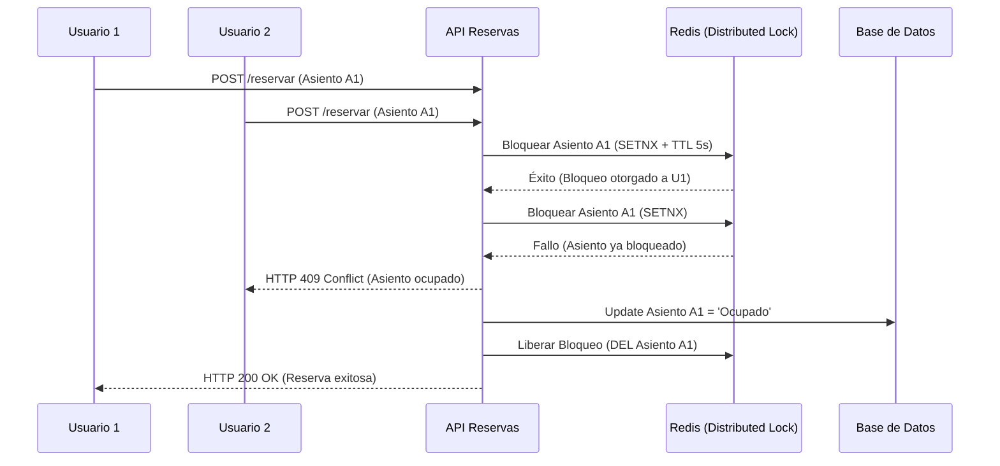
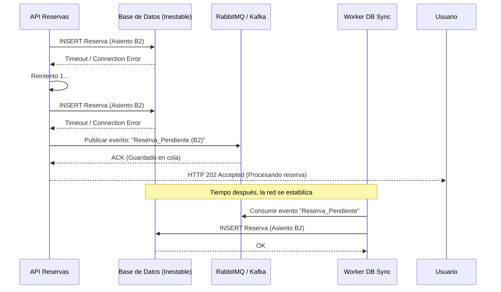

# Práctica de Tolerancia a Fallos: Sistema Distribuido de Reservas

**Universidad Politécnica Salesiana**  
**Autores:** Daniel Guanga, Valeria Mantilla

---

## 📌 Descripción General
Este proyecto implementa y documenta una arquitectura de microservicios orientada a la venta de entradas. El objetivo principal es experimentar empíricamente con la inyección de anomalías sobre un clúster de Kubernetes y blindar el sistema utilizando patrones de resiliencia reconocidos en la industria. 

El proyecto consta de la implementación en código de 4 mecanismos de defensa (Parte III) y el análisis teórico de nivel de producción para 2 fallos de consistencia y conectividad (Parte V).

---

## 🏗️ Parte I: Arquitectura y Despliegue

El sistema está desplegado sobre un clúster local utilizando Minikube, simulando dos nodos (Control Plane y Worker) mediante restricciones de afinidad, asegurando la distribución de la carga.

### Componentes:
* **API Gateway / Orquestador (Reservas):** Punto de entrada y gestor de transacciones.
* **Servicio de Inventario:** Gestiona la disponibilidad de asientos (Stub).
* **Servicio de Pagos:** Simula una pasarela externa con alta latencia (Stub).
* **Servicio de Notificaciones:** Emite confirmaciones de forma asíncrona (Stub).

### 🚀 Instrucciones de Despliegue Local
Para reproducir la infraestructura en cualquier equipo:

1. Iniciar el clúster con un perfil dedicado:
    ```bash
    minikube start -p cluster-reservas
    ```

2. Cargar las imágenes Docker de los microservicios en el clúster:
    ```bash
    minikube image load app-inventario:v1 app-notificaciones:v1 app-pagos:v1 app-reservas:v6 -p cluster-reservas
    ```

3. Aplicar el manifiesto de infraestructura:
    ```bash
    kubectl apply -f arquitectura.yaml
    ```

4. Abrir el túnel de red para el tráfico externo:
    ```bash
    kubectl port-forward svc/reservas-svc 3000:80
    ```

---

## 🛡️ Parte III: Implementación de Resiliencia (Los 4 Mecanismos)

Se seleccionaron y programaron los siguientes patrones de resiliencia en el Orquestador de Reservas (Node.js/Express) para tolerar fallos inyectados en la infraestructura:

* **La Pasarela Lenta (Circuit Breaker):** 
  * **Fallo:** El servicio de pagos demora más de 20 segundos.
  * **Solución:** Implementación de `opossum`. Si el pago excede los 2 segundos, el circuito se abre y devuelve un estado de `"cobro pendiente"`, evitando el agotamiento de hilos (thread starvation).
* **El Inventario Fantasma (Retries con Backoff):**
  * **Fallo:** Caída aleatoria o indisponibilidad temporal del pod de inventario (HTTP 503).
  * **Solución:** Uso de `axios-retry`. El sistema reintenta la conexión hasta 3 veces con tiempo de espera exponencial, logrando salvar la transacción sin lanzar errores 500 al cliente.
* **El Correo Perdido (Fire-and-Forget / Cola Asíncrona):**
  * **Fallo:** Lentitud severa en el servicio de notificaciones (8 segundos de retraso).
  * **Solución:** Ejecución asíncrona sin `await`. El orquestador delega el envío a un proceso en segundo plano y responde inmediatamente al cliente, aislando la latencia.
* **El Diluvio de Peticiones (Rate Limiting):**
  * **Fallo:** Pico anómalo de tráfico o ataque DDoS.
  * **Solución:** Implementación de `express-rate-limit` (Max 3 peticiones / 15 seg). El clúster se protege rechazando el tráfico excedente en el API Gateway con un código HTTP `429 Too Many Requests`.

---

## 🧠 Parte V: Análisis y Diseño Teórico (Entornos de Producción)

A continuación, se presenta el análisis técnico y las propuestas arquitectónicas para los 2 escenarios de fallo que no fueron cubiertos mediante código, evaluados bajo criterios de sistemas distribuidos a gran escala.

### 5.1. Condición de Carrera (Consistencia)
**El Escenario:** Dos usuarios distintos intentan comprar el último asiento disponible (ej. A1) exactamente en el mismo milisegundo. 

**Análisis Teórico:** 
Este es un problema clásico de concurrencia y violaciones de consistencia. En términos del Teorema CAP, si priorizamos la Alta Disponibilidad (A) sin mecanismos de sincronización, la base de datos procesará dos lecturas simultáneas (ambas verán el asiento "Libre") y ejecutará dos escrituras (ambas reservarán el mismo asiento). Esto genera un estado corrupto (Overbooking).

**Solución de Producción Propuesta:**
Implementar un **Bloqueo Pesimista (Pessimistic Locking)** a nivel de base de datos o un **Distributed Lock (Cerrojo Distribuido)** usando Redis.
Cuando el Usuario 1 solicita el asiento, el sistema bloquea el registro temporalmente (`SELECT ... FOR UPDATE` en SQL o un SETNX en Redis). Si el Usuario 2 llega un milisegundo después, su hilo quedará en espera o será rechazado inmediatamente hasta que el Usuario 1 termine la transacción (commit) o expire un *TTL (Time to Live)* del bloqueo.

**Diagrama de Solución (Redis Lock):**


### 5.2. Base de Datos Intermitente (Conectividad)
**El Escenario:** La conexión a la base de datos principal sufre caídas intermitentes (flapping) por problemas en la red física o reinicios del motor, perdiendo paquetes durante las escrituras.

**Análisis Teórico:**
El Network Flapping es letal para los microservicios porque las peticiones TCP/IP se quedan en estado de espera (timeout). Si cientos de peticiones llegan y la BD no responde ni rechaza la conexión, el servicio de reservas agotará su memoria, sus hilos de ejecución o los puertos disponibles (Port Exhaustion), colapsando el nodo completo de Kubernetes de forma en cascada.

**Solución de Producción Propuesta:**
En un entorno de producción, la resiliencia de datos requiere dos capas:

- **Connection Pooling con Validación:** Configurar el ORM/Driver para no usar conexiones "muertas" (ej. test-on-borrow) y usar reintentos automáticos a nivel de driver.

- **Patrón Fallback hacia Cola de Mensajes (DLQ):** Si la base de datos está inaccesible tras varios reintentos, el servicio no descarta la transacción. En su lugar, serializa la orden de compra y la envía a un Dead Letter Queue o un sistema de streaming (como Apache Kafka o RabbitMQ). Cuando la base de datos se estabilice, un servicio worker asíncrono consumirá la cola y aplicará las escrituras pendientes para lograr Consistencia Eventual.

**Diagrama de Solución (Cola de Respaldo):**

